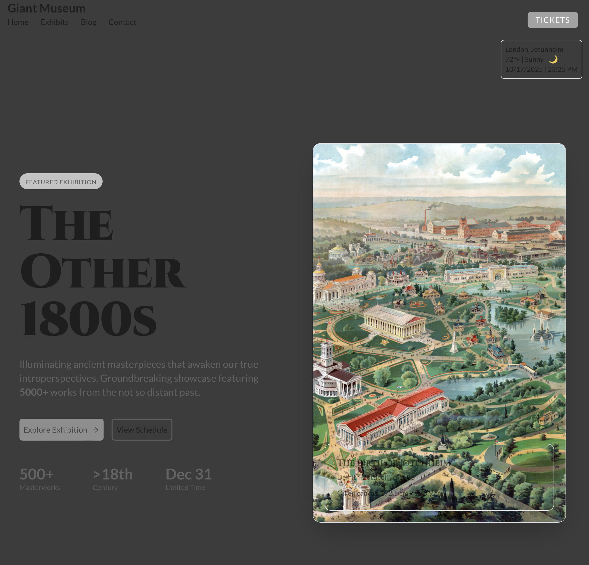
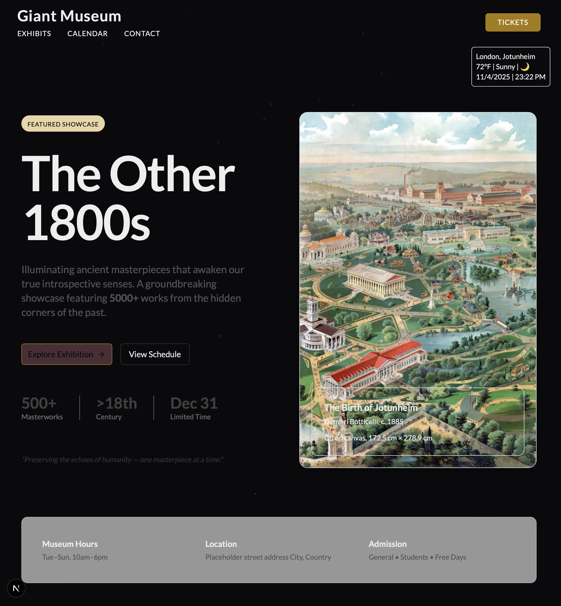

NextJS project #1 11/2025

## 11 4 2025 ⭐️

I started this project in bliss; now i use my skills and create something beautiful. At surface, I am going with the flow for this project. Interesting experiment. Lster in the project, I decided to practice Terraform, Docker and Minikube. Three days straight I attempted to complete the exercise and build with Docker. No luck so I decided to build locally and just copy the image. Stopping ehre means that was

---

# 📚 Giant Museum Portfolio Website

_A Huge museum overflowing with artifacts from the ancient future and the distant past. Carefully curated digital experience showcasing exhibitions, collections, and a fresh perspective._

## 🖼️ Overview

The **Giant Museum Portfolio Website** is a modern, accessible, and responsive digital experience designed to highlight a museum’s identity, exhibitions, permanent collections, and educational initiatives.
The site aims to bridge digital and physical spaces by offering visitors an engaging, intuitive, and visually rich interface.

This project demonstrates expertise in Web Developement, UI/UX, Content Architecture, and Project Management.

---

## 🎯 Objectives

- Present museum information in a vibrant, organized, and visually appealing way
- Ensure accessibility following WCAG principles
- Create a flexible content structure suitable for art, history, culture, and science museums
- Provide an immersive storytelling experience through imagery, typography, and layout
- Allow for easy addition of exhibitions, artworks, and events

---

## 🧩 Features

- **Homepage hero gallery** showcasing featured exhibitions
- **Exhibitions Section** with individual detail pages
- **Artwork / Artifact Collection** with filters and media modals
- **About Page** describing museum mission and history
- **Visitor Information** (hours, tickets, directions)
- **Events & Educational Programs**
- **Responsive design** for mobile, tablet, and desktop
- **Accessibility improvements** such as alt text, contrast, and keyboard navigation
- **[Good to have] CMS integration**

---

## 🛠️ Tech Stack

- **Framework:** Next.js / HTML-CSS-JS
- **Styling:** Tailwind CSS
- **Animations:** GSAP
- **CMS:** Sanity
- **Deployment:** Vercel
- **Version Control:** Git + GitHub
- Project Assistant for menial tasks: ChatGPT, v0.dev

---

## 📁 Project Structure

```plaintext
/public
  ├─ images/
  └─ icons/

/src
  ├─ components/
  ├─ exhibits/
  └─ img/
```

---

## 🚀 Getting Started

### 1. Clone my repository

```bash
git clone https://github.com/ceo-demitri/giant-museum.git
cd giant-museum
```

### 2. Install dependencies

```bash
bun install
```

### 3. Run the development server

```bash
bun run dev
```

### 4. Build for production

```bash
bun run build
```

---

## 💡 Design Principles

- **Modern layout** to emphasize artwork and exhibitions
- **High-quality media** to enhance the gallery experience
- **Elegant, museum-inspired typography**
- **Consistent grid and spacing system** for visual balance

---

## 📸 Take a Peek

_(Greyscale Hero)_

_(Version 2)_

_(Version 3)_


---

## 📐 Future Features

- Multi-language support
- Interactive floor plan
- Virtual tour integration
- API-connected collection database

---

## 👤 Creator

**Demitri Echols** <br>
Portfolio: _demitri26.vercel.app_ <br>
Email: _[iprogramidesign@gmail.com](mailto:iprogramidesign@gmail.com)_

---

[//]: # "erase section when project done"

### next sprint due 12 / 7

- [ x ] figma hero [entire landing lofi complete]
- [ ] i like it in this state. iterate from here. check when landing page base complete.

**goal** complete landing page, skeleton professional web "portfolio" for a public business
